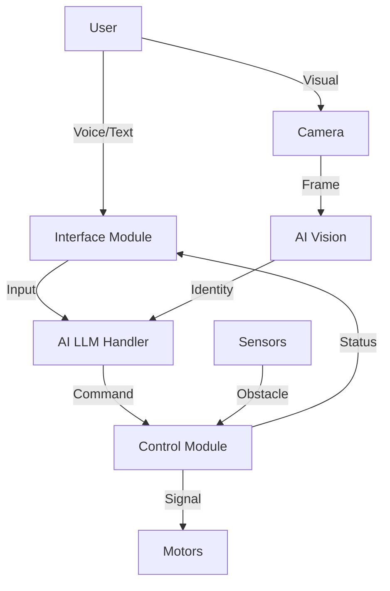

# Setup and Installation Guide

## Prerequisites
- **Python 3.8+**
- **Ollama**: Installed and running locally for AI.
- **Hardware**: Raspberry Pi (or similar), Camera module, Motor Driver, Sensors.

## Installation Steps

1.  **Clone the Repository**
    ```bash
    git clone <repo_url>
    cd Robot
    ```

2.  **Install Dependencies**
    It is recommended to use a virtual environment.
    ```bash
    python3 -m venv venv
    source venv/bin/activate
    pip install -r requirements.txt
    ```
    *Note: `face_recognition` may require `cmake` and `dlib` pre-installed.*

3.  **Hardware Wiring**
    Refer to `control/motor_driver.py` for PIN configurations.
    - **Motors**: GPIO 17, 18 (Left), 22, 23 (Right)
    - **Ultrasonic**: Trig 5, Echo 6
    - **I2C LCD**: Address 0x27

4.  **AI Setup**
    - Install Ollama from [ollama.com](https://ollama.com).
    - Pull the model: `ollama pull llama3.2:3b`.
    - Start the server: `ollama serve`.

## Deployment on Raspberry Pi

### 1. Prepare Your Raspberry Pi
*   **Operating System**: Make sure your Raspberry Pi has an operating system installed, typically Raspberry Pi OS. You don’t need to clear it unless you want a fresh setup.
*   **Network Connection**: Ensure your Raspberry Pi is connected to the same network as your development machine (or use a hotspot).

### 2. Transfer Files
**Using SCP (Secure Copy)**:
Open a terminal on your computer and run:
```bash
scp -r /path/to/Robot pi@<raspberry_pi_ip>:/home/pi/
```
Replace `/path/to/Robot` with the path to this project folder, and `<raspberry_pi_ip>` with your Pi's IP address.

**Using SFTP**:
You can also use a client like FileZilla. Connect using SFTP with the IP, username (default: `pi`), and password, then drag and drop the files.

### 3. Setting Up the Environment on Raspberry Pi
**Dependencies**:
SSH into your Pi (`ssh pi@<ip>`) and install required system and python libraries:
```bash
sudo apt-get update
sudo apt-get install python3-pip cmake
cd /home/pi/Robot
pip3 install -r requirements.txt
```
*Tip: `face_recognition` compiles heavy C++ code; this might take a while on a Pi 3/4.*

**Running the Code**:
Navigate to the project directory and run the main script:
```bash
cd /home/pi/Robot
python3 main.py
```

### 4. Automation and Running on Startup
**Startup Script (Systemd Service)**:
To run automatically on boot, create a service file:
1.  Create file: `sudo nano /etc/systemd/system/robot.service`
2.  Add content:
    ```ini
    [Unit]
    Description=AI Robot Service
    After=network.target

    [Service]
    ExecStart=/usr/bin/python3 /home/pi/Robot/main.py
    WorkingDirectory=/home/pi/Robot
    StandardOutput=inherit
    StandardError=inherit
    Restart=always
    User=pi

    [Install]
    WantedBy=multi-user.target
    ```
3.  Enable it:
    ```bash
    sudo systemctl enable robot.service
    sudo systemctl start robot.service
    ```

**Testing**:
Once everything is transferred and set up, reboot (`sudo reboot`) and check if the robot initializes automatically (LCD should show "BOOTING").

## System Architecture Diagram

